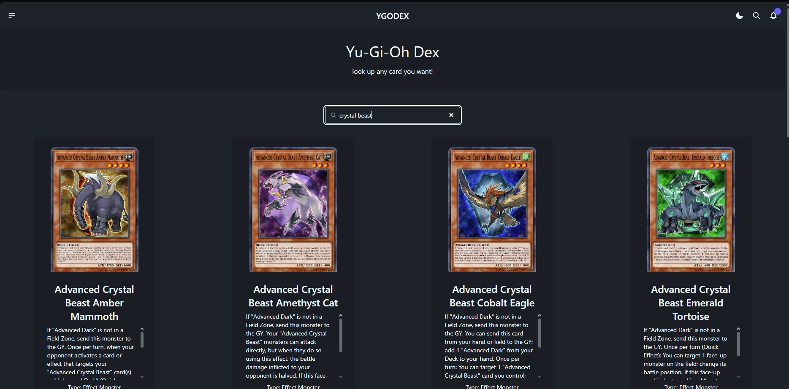
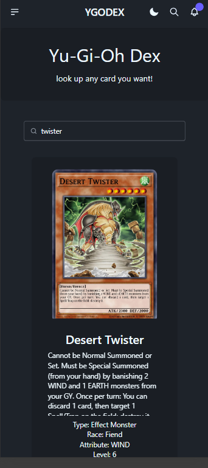
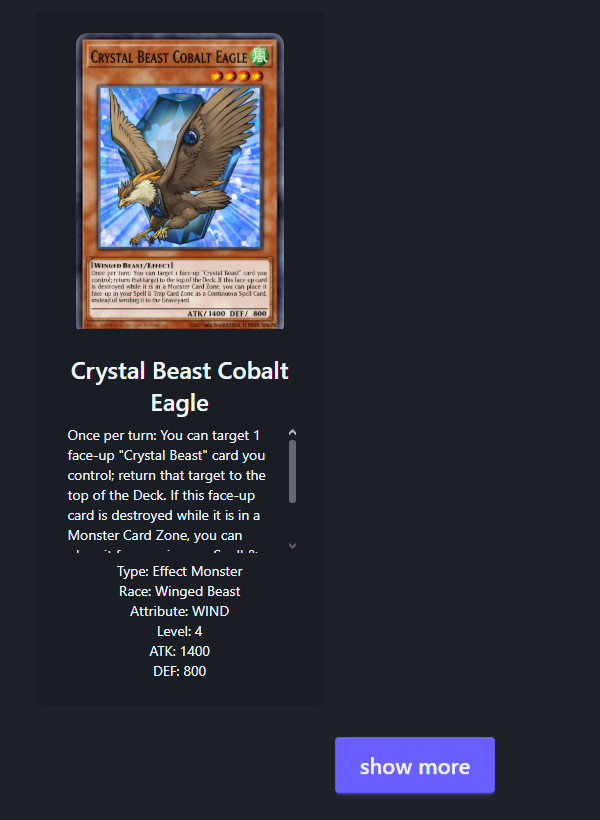

# Yu-Gi-Oh Dex

## Disclaimer

Dieses Projekt ist ein privates Lernprojekt und dient ausschließlich zum Üben von React, TypeScript, Express und MongoDB. Yu-Gi-Oh!, die Kartennamen, Kartendaten, Kartenbilder und zugehörige Markenrechte gehören ihren jeweiligen Rechteinhabern, insbesondere Konami. Dieses Projekt steht in keiner Verbindung zu Konami und verfolgt keinen kommerziellen Zweck.

Yu-Gi-Oh Dex ist ein Fullstack-Übungsprojekt mit React, TypeScript, Express und MongoDB. Die App sucht Yu-Gi-Oh Karten, zeigt passende Ergebnisse als Karten-Grid an und speichert Kartendaten sowie lokal gecachte Kartenbilder über ein eigenes Backend.

Das Projekt ist bewusst als Lernprojekt aufgebaut: Frontend und Backend sind getrennt, die API-Kommunikation läuft über eigene Routen, und externe Bilder werden nicht dauerhaft direkt vom Frontend geladen.

## Vorschau

### Desktop



### Mobile



### Show More



## Features

- Suche nach Yu-Gi-Oh Karten über eine React-Suchleiste
- Anzeige mehrerer Suchergebnisse als responsive Karten
- Pagination mit `Show more` Button
- Backend-Suche über MongoDB
- Zufällige Karte über eine eigene Backend-Route
- Hero Section mit automatisch wechselnden Random Cards
- Import der Kartendaten aus der YGOPRODeck API
- Lokales Lazy-Caching von Kartenbildern
- Statische Auslieferung gespeicherter Bilder über Express
- Dark/Light Theme Toggle mit DaisyUI
- Getrennte Komponenten für Layout, Navbar, Footer, Searchbar, Cards und Show-More-Button
- Custom Hook `useRandomCard` für automatische Random-Card-Logik
- Typisierte Props und Events mit TypeScript

## Geplante Features

- Weitere Design-Verbesserungen für Karten, Hero Section, Layout, Abstände und responsive Darstellung
- Deckbuilder, mit dem eigene Kartendecks zusammengestellt werden können
- Login-System, damit Benutzer eigene Decks speichern und später wieder laden können
- Detailansicht für einzelne Karten
- Fehler- und Ladezustände im Frontend, zum Beispiel bei leeren Suchergebnissen

## Grundidee

Das Frontend fragt nicht direkt die externe Yu-Gi-Oh API ab. Stattdessen spricht es das eigene Backend an.

Der Ablauf:

1. Das Frontend sendet eine Suche an das Backend.
2. Das Backend sucht passende Karten in MongoDB.
3. Für die gefundenen Karten prüft das Backend, ob bereits ein lokales Bild gespeichert ist.
4. Falls kein lokales Bild vorhanden ist, wird es einmalig von der externen API geladen und lokal gespeichert.
5. Das Backend gibt die Karten inklusive lokalem `imagePath` ans Frontend zurück.
6. Das Frontend zeigt die Karten mit Bildern, Beschreibung und Details an.

Zusätzlich gibt es eine Random-Card-Funktion:

1. Das Frontend ruft eine eigene Random-Route im Backend auf.
2. Das Backend wählt eine zufällige Karte aus MongoDB aus.
3. Auch diese Karte durchläuft das lokale Bild-Caching.
4. Im Frontend lädt der Custom Hook `useRandomCard` automatisch eine Karte und aktualisiert sie in einem Intervall.
5. Die Hero Section zeigt links und rechts je eine zufällige Karte an.

Dadurch werden Bilder nicht bei jedem Suchvorgang erneut von der externen API geladen.

## Projektstruktur

```txt
05/
+-- Backend/
|   +-- src/
|   |   +-- config/
|   |   |   +-- settings.ts
|   |   +-- features/
|   |   |   +-- cards/
|   |   |       +-- cards.controller.ts
|   |   |       +-- cards.model.ts
|   |   |       +-- cards.routes.ts
|   |   |       +-- image.service.ts
|   |   +-- lib/
|   |   |   +-- handleError/
|   |   +-- types/
|   |   +-- db.ts
|   |   +-- index.ts
|   +-- public/
|       +-- card-images/
|
+-- YuGiOhDex/
    +-- public/
    |   +-- img/
    +-- src/
        +-- features/
        |   +-- cards/
        |   |   +-- components/
        |   |   |   +-- molecules/
        |   |   +-- lib/
        |   +-- hero/
        |   |   +-- components/
        |   |       +-- organisms/
        |   +-- randomCard/
        |   |   +-- api/
        |   |   +-- components/
        |   |   |   +-- molecules/
        |   |   |   +-- organisms/
        |   |   +-- hooks/
        |   |   +-- types/
        |   +-- search/
        |       +-- api/
        |       +-- components/
        |       |   +-- atoms/
        |       |   +-- molecules/
        |       +-- types/
        +-- layouts/
        |   +-- organisms/
        |   +-- templates/
        +-- shared/
        |   +-- components/
        |   |   +-- molecules/
        |   +-- lib/
        +-- types/
```

## Backend

Das Backend basiert auf Express, TypeScript und Mongoose.

### Wichtige Dateien

- `src/index.ts`: Startet Express, aktiviert CORS, JSON-Parsing, Static Files und Error Handling.
- `src/db.ts`: Baut die Verbindung zu MongoDB auf.
- `src/features/cards/cards.routes.ts`: Definiert die Cards-Routen.
- `src/features/cards/cards.controller.ts`: Enthält Import- und Suchlogik.
- `src/features/cards/cards.model.ts`: Definiert das Mongoose Card Model.
- `src/features/cards/image.service.ts`: Lädt Kartenbilder bei Bedarf herunter und speichert sie lokal.

### API-Routen

#### Karten importieren

```http
POST http://localhost:3000/api/cards/import
```

Diese Route lädt die Kartendaten von der YGOPRODeck API und speichert oder aktualisiert sie in MongoDB. Bilder werden dabei noch nicht heruntergeladen.

#### Karten suchen

```http
GET http://localhost:3000/api/cards/search/:cardName?page=1
```

Beispiel:

```http
GET http://localhost:3000/api/cards/search/Dark%20Magician?page=1
```

Die Route sucht Karten nach Namen, gibt maximal 10 Ergebnisse pro Seite zurück und liefert Metadaten für `Show more`.

Beispielhafte Antwortstruktur:

```json
{
  "status": 200,
  "message": "All card data by name",
  "data": [
    {
      "cards": [],
      "page": 1,
      "limit": 10,
      "totalCards": 25,
      "hasMore": true
    }
  ]
}
```

#### Zufällige Karte laden

```http
GET http://localhost:3000/api/cards/random
```

Diese Route wählt eine zufällige Karte aus MongoDB aus und gibt genau eine Karte zurück. Falls das Bild dieser Karte noch nicht lokal gespeichert ist, wird es zuerst heruntergeladen und anschließend über den lokalen `imagePath` bereitgestellt.

Beispielhafte Antwortstruktur:

```json
{
  "status": 200,
  "message": "Random card successfully loaded",
  "data": [
    {
      "ygoId": 46986414,
      "name": "Dark Magician",
      "type": "Normal Monster",
      "description": "The ultimate wizard in terms of attack and defense.",
      "imagePath": "/card-images/46986414.jpg"
    }
  ]
}
```

### Bild-Caching

Die Bilder werden lazy gespeichert:

- Beim Import wird nur die externe Bild-URL in MongoDB gespeichert.
- Beim Suchen prüft `image.service.ts`, ob `imagePath` vorhanden ist.
- Falls nicht, wird das Bild heruntergeladen.
- Das Bild wird in `Backend/public/card-images/` gespeichert.
- Danach wird der lokale Pfad in MongoDB gespeichert.

Dadurch werden externe Bildanfragen reduziert.

## Frontend

Das Frontend basiert auf React, TypeScript, Vite, Tailwind CSS und DaisyUI.

Die Frontend-Struktur kombiniert Feature-based Architecture mit Atomic Design. Fachliche Bereiche wie `cards`, `search`, `randomCard` und `hero` liegen unter `src/features`. Innerhalb dieser Features werden UI-Komponenten nach Atomic Design in `atoms`, `molecules` und `organisms` sortiert. Wiederverwendbare, feature-unabhängige Komponenten liegen unter `src/shared`.

### Datei-Flags

Zur besseren Suche in VS Code werden Dateisuffixe als kleine Flags genutzt:

```txt
.atm.tsx    Atom-Komponente
.mol.tsx    Molecule-Komponente
.org.tsx    Organism-Komponente
.tpl.tsx    Template-Komponente
.types.ts   TypeScript Types
.helper.ts  Helper-Funktion
```

Beispiele:

```txt
showMore.btn.atm.tsx
cardSearchBar.mol.tsx
public.hero.org.tsx
cardLayout.tpl.tsx
header.types.ts
```

### Wichtige Dateien

- `src/App.tsx`: Bindet das Public Layout und den Hauptinhalt ein.
- `src/layouts/templates/PublicLayout/public.layout.tpl.tsx`: Basislayout mit Navbar, Main-Bereich und Footer.
- `src/layouts/templates/CardLayout/cardLayout.tpl.tsx`: Steuert Suche, Karten-State, Pagination und Rendering.
- `src/layouts/organisms/PublicNavbar/public.navbar.org.tsx`: Öffentliche Navbar mit Theme Toggle.
- `src/layouts/organisms/PublicFooter/public.footer.org.tsx`: Footer des Public Layouts.
- `src/features/hero/components/organisms/PublicHero/public.hero.org.tsx`: Hero Section mit zentralem Text und zwei automatisch wechselnden Random Cards.
- `src/features/search/components/molecules/CardSearchBar/cardSearchBar.mol.tsx`: Suchformular mit Input.
- `src/features/search/components/atoms/ShowMoreButton/showMore.btn.atm.tsx`: Button für weitere Suchergebnisse.
- `src/features/cards/components/molecules/YuGiOhCard/yugiohCard.mol.tsx`: Einzelne Kartenanzeige.
- `src/features/randomCard/components/organisms/RandomCard/randomCard.org.tsx`: Container-Komponente für die zufällige Karte.
- `src/features/randomCard/components/molecules/DisplayRandomCard/displayRandomCard.mol.tsx`: Reine Anzeige-Komponente für eine zufällige Karte.
- `src/features/randomCard/hooks/useRandomCard.ts`: Custom Hook, der eine zufällige Karte lädt und regelmäßig aktualisiert.
- `src/features/search/api/getCard.ts`: API-Helper für die Kartensuche.
- `src/features/randomCard/api/getRandomCard.ts`: API-Helper für die Random-Card-Route.
- `src/features/cards/lib/getCardDetails.helper.ts`: Helper für optionale Kartendetails.
- `src/shared/components/molecules/Header/header.mol.tsx`: Wiederverwendbare Header-Komponente.
- `src/types/card.types.ts`: Globaler Domain-Type für Karten.

### Datenfluss im Frontend

1. User gibt einen Kartennamen in die Searchbar ein.
2. `CardSearchBar` gibt den Suchwert an `CardLayout` weiter.
3. `CardLayout` ruft `getCard` auf.
4. `getCard` fragt das Backend an.
5. `CardLayout` speichert die erhaltenen Karten im State.
6. Das Grid rendert für jede Karte eine `YuGiOhCard`.
7. Wenn `hasMore` true ist, wird der `ShowMoreBtn` angezeigt.
8. Beim Klick auf `Show more` wird die nächste Seite geladen und an die bestehenden Karten angehängt.

### Datenfluss der Random Cards

1. `PublicHero` rendert links und rechts je eine `RandomCard`.
2. `RandomCard` nutzt den Custom Hook `useRandomCard`.
3. `useRandomCard` ruft `getRandomCard` auf.
4. `getRandomCard` fragt `GET /api/cards/random` im Backend an.
5. Die geladene Karte wird im Hook-State gespeichert.
6. `RandomCard` gibt die Karte an `DisplayRandomCard` weiter.
7. Nach 10 Sekunden lädt der Hook automatisch eine neue zufällige Karte.

## Technologien

### Frontend

- React 19
- TypeScript
- Vite
- Tailwind CSS
- DaisyUI

### Backend

- Node.js
- Express 5
- TypeScript
- MongoDB
- Mongoose
- CORS
- dotenv
- nodemon
- ts-node

## Setup

### Voraussetzungen

- Node.js
- MongoDB lokal oder eine MongoDB-Verbindung
- Zwei Terminals: eins für Backend, eins für Frontend

### Backend starten

```bash
cd Backend
npm install
npm run dev
```

Die `.env` im Backend sollte ungefähr so aussehen:

```env
PORT=3000
BASE_URL=/api
MONGODB_URL=mongodb://localhost:27017/yugiohdex
```

Wenn der Server läuft, sollte in der Konsole stehen:

```txt
Connected to MongoDB
Server Booted at Port 3000
```

### Frontend starten

```bash
cd YuGiOhDex
npm install
npm run dev
```

Das Frontend läuft normalerweise unter:

```txt
http://localhost:5173
```

## Erste Nutzung

Vor der Suche sollten die Kartendaten einmal importiert werden:

```http
POST http://localhost:3000/api/cards/import
```

Danach kann im Frontend gesucht werden, zum Beispiel nach:

```txt
Dark Magician
Blue-Eyes
Kuriboh
```

## Aktueller Funktionsstand

Funktioniert bereits:

- Backend startet und verbindet sich mit MongoDB.
- Kartendaten können importiert werden.
- Kartensuche funktioniert über das Backend.
- Zufällige Karten können über `/api/cards/random` geladen werden.
- Bilder werden beim ersten Anzeigen lokal gespeichert.
- Bereits gespeicherte Bilder werden wiederverwendet.
- Die Hero Section zeigt automatisch wechselnde Random Cards.
- Frontend rendert Suchergebnisse als Karten.
- `Show more` lädt weitere Ergebnisse.
- Theme Toggle funktioniert.
- Footer bleibt unten im Layout.

Noch mögliche nächste Schritte:

- Fehlerzustand im Frontend anzeigen, wenn keine Karten gefunden werden.
- Loading-State während der Suche anzeigen.
- Suche toleranter machen, z.B. `Blue eyes` auch für `Blue-Eyes`.
- Detailansicht für einzelne Karten bauen.
- Hero Section und Random Cards optisch weiter verfeinern.
- Button/Links in Navbar mit echten Funktionen verbinden.
- API-URL im Frontend in eine Config oder `.env` auslagern.
- Geplanten Deckbuilder vorbereiten.
- Login und benutzerbezogene Datenstruktur planen.

## Lernfokus

Dieses Projekt übt besonders:

- Komponenten sinnvoll aufteilen
- Props und Callback-Funktionen einsetzen
- State für Suchergebnisse und Pagination verwenden
- Custom Hooks einsetzen, um State- und Effect-Logik aus Komponenten auszulagern
- TypeScript Types für Props, Events und API-Parameter auslagern
- Express-Routen strukturieren
- MongoDB-Dokumente mit Mongoose speichern und aktualisieren
- Zufällige Dokumente aus MongoDB laden
- Externe APIs über ein eigenes Backend kapseln
- Lokale Dateien aus dem Backend statisch ausliefern
